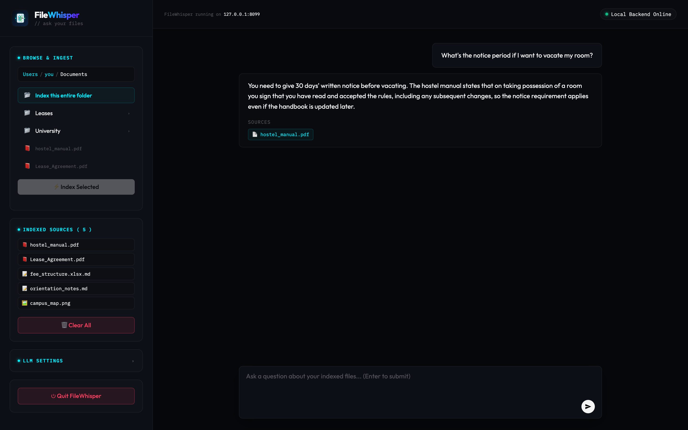

<div align="center">

# FileWhisper

### Chat with your files. 100% local. One-line install.

FileWhisper indexes documents on your computer and answers questions about them with an LLM — **your files never leave your machine.** No cloud upload, no account, and it works out of the box with **no API key**.

<!--
  TIP: a short GIF beats any screenshot here. Record one (open app → drop a PDF →
  ask a question → answer appears), save it as docs/demo.gif, and replace the
   below with:  
  Free recorders: Kap (macOS, getkap.co), ScreenToGif (Windows), Peek (Linux).
-->


</div>

---

## Why FileWhisper?

- **Truly private** — parsing, OCR, embeddings, and vector search all run locally. Only your question and the matched snippets are sent to the LLM, and even that can be a free keyless model.
- **One-line install, no setup** — no Git, Node, Rust, or manual Python. Paste one command, get a double-click app on your Desktop.
- **Works with zero API keys** — ships with a free built-in assistant. Add a Groq/OpenAI/Claude/Gemini key only if you want faster or sharper answers.
- **Lightweight** — a slim ONNX stack (no PyTorch); the whole install incl. OCR is ~435 MB.
- **Handles real documents** — `.txt`, `.md`, `.pdf`, and images (`.png/.jpg/.webp/.bmp/.tiff`), with automatic OCR for scanned PDFs and pictures.

## Install

### macOS & Linux

Open a **Terminal** and paste:

```bash
curl -fsSL https://raw.githubusercontent.com/ishankanodia/FileWhisper/main/install.sh | bash
```

### Windows 10/11

Open **PowerShell** and paste:

```powershell
irm https://raw.githubusercontent.com/ishankanodia/FileWhisper/main/install.ps1 | iex
```

The installer downloads FileWhisper, builds a small isolated environment (~435 MB, no PyTorch), pre-loads the local AI models, and drops a single **FileWhisper** launcher on your Desktop. After that, just **double-click FileWhisper** — it opens in your browser with **no terminal/console window**. To stop it, click **Quit FileWhisper** inside the app.

> The launcher is generated on your own machine, so macOS doesn't flag it as an "unidentified developer" — it just opens. (On Linux you may need to right-click the Desktop icon → **Allow Launching** the first time.)

**To update:** re-run the same one-line command. It rebuilds from the latest version; your indexed data is preserved.

## How it works

```
your files ─► parse + OCR ─► chunk ─► ONNX MiniLM embeddings ─► FAISS index
                                                                    │
              answer ◄── LLM (free or your key) ◄── retrieve top matches ◄┘
```

A LangGraph pipeline retrieves the most relevant chunks, asks the LLM to answer **only** from those chunks, and suggests a follow-up question. Everything except the final LLM call is local; the index lives in `~/.filewhisper/rag_data`.

## Bring your own model (optional)

Out of the box, FileWhisper uses a free keyless assistant. To use your own provider, open **LLM Settings** in the app (or set environment variables for dev), choosing from:

| Provider | Example model |
|---|---|
| Groq | `llama-3.3-70b-versatile` |
| OpenAI | `gpt-5-mini` |
| Anthropic Claude | `claude-sonnet-4-6` |
| Google Gemini | `gemini-2.5-flash` |
| Custom (OpenAI-compatible) | any `LLM_BASE_URL` |

```bash
LLM_PROVIDER=groq
LLM_MODEL=llama-3.3-70b-versatile
GROQ_API_KEY=your_key
```

## Run from source (developers)

```bash
git clone https://github.com/ishankanodia/FileWhisper.git
cd FileWhisper
python3 -m venv .venv && source .venv/bin/activate
pip install -r requirements.txt
cp .env.example .env
python -m filewhisper.server_launcher   # opens http://localhost:8001
```

OCR for images and scanned PDFs is built in (ONNX — no system Tesseract required).

## Project structure

```text
install.sh / install.ps1        One-line installers (macOS/Linux, Windows)
filewhisper/main.py             FastAPI app, endpoints, LLM routing
filewhisper/rag.py              Ingestion, chunking, ONNX embeddings, FAISS search
filewhisper/server_launcher.py  Local launcher (free port, opens browser)
filewhisper/static/index.html   The UI (file browser + chat)
docs/                           Website (GitHub Pages) + screenshot
```

## Privacy & analytics

Your documents and questions never leave your machine except for the final LLM call (which you control — use the free local provider for zero external calls).

The **installer** sends a single anonymous ping on install (operating system + version only — no personal data, no file info, no identifiers) so we can gauge how many people use FileWhisper. To opt out, set either environment variable before installing:

```bash
DO_NOT_TRACK=1 curl -fsSL https://raw.githubusercontent.com/ishankanodia/FileWhisper/main/install.sh | bash
```

```powershell
$env:DO_NOT_TRACK=1; irm https://raw.githubusercontent.com/ishankanodia/FileWhisper/main/install.ps1 | iex
```

(`FILEWHISPER_NO_ANALYTICS=1` works too.)

## Security notes

- Don't commit `.env` or `rag_data/` (it can contain private document text and local file paths).
- A hosted web app cannot browse a user's local folders — for hosted mode, use file uploads instead and never expose `/browse` publicly.
- Revoke any API key that was ever committed to git history.

---

<div align="center">
Made for people who want to ask their own files questions — without handing them to the cloud.
</div>
